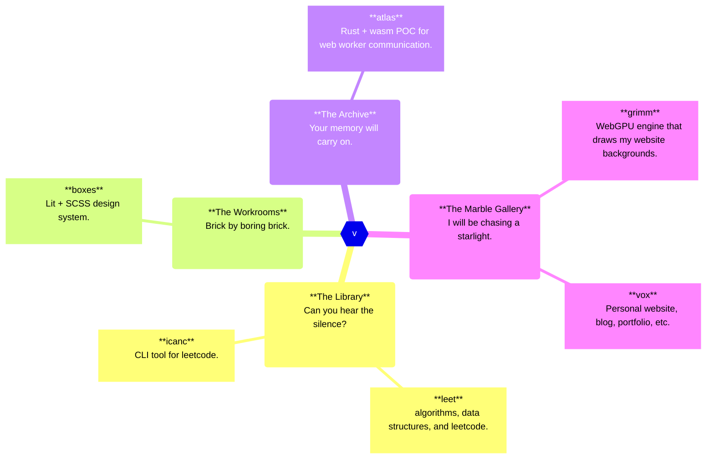

## oh hi
<!-- https://youtu.be/4NYsqm2E41k -->

```mermaid
mindmap
  root{{v}}
    (
        **The Library**
        Can you hear the silence?
        <!-- Can you see the dark? -->
    )
      [
        **leet**
        algorithms, data structures, and leetcode.
      ]
      [
        **icanc**
        CLI tool for leetcode.
      ]
    (
        <!-- The word "workshop" was taken from us. -->
        **The Workrooms**
        Brick by boring brick.
        <!-- Or the wolf's gonna blow it down. -->
    )
      [
        **boxes**
        Lit + SCSS design system.
      ]
    (
        **The Archive**
        Your memory will carry on.
        <!-- We'll carry on. -->
    )
      [
        **atlas**
        Rust + wasm POC for web worker communication.
      ]
    (
        **The Marble Gallery**
        I will be chasing a starlight.
        <!-- Until the end of my life. -->
    )
      [
        **grimm**
        WebGPU engine that draws my website backgrounds.
      ]
      [
        **vox**
        Personal website, blog, portfolio, etc.
      ]
```
